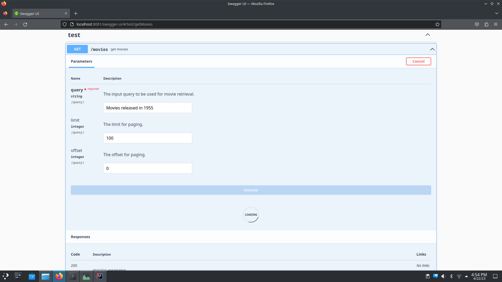
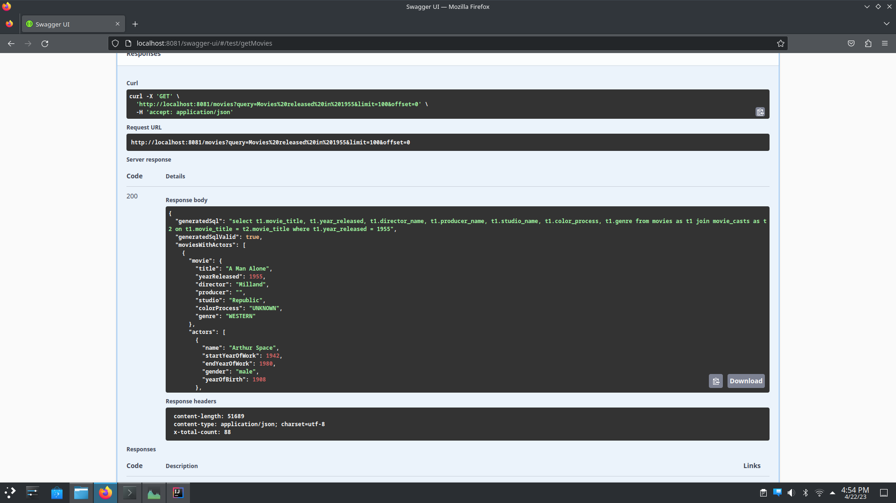
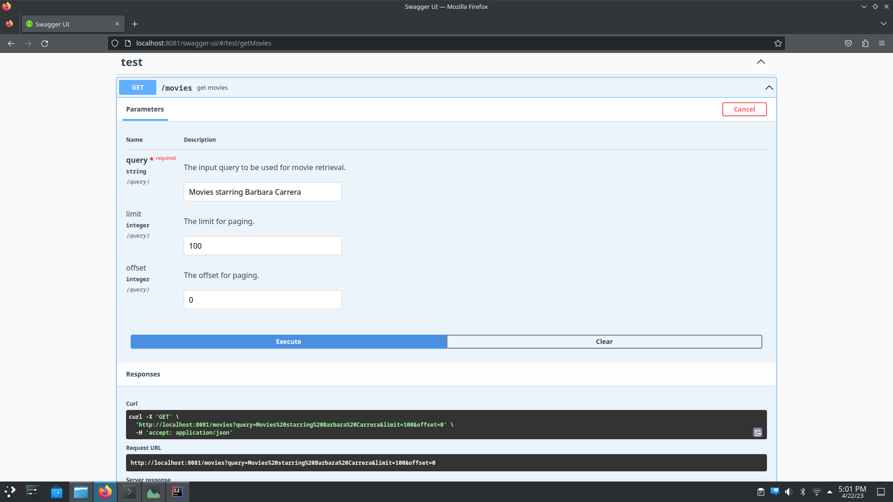
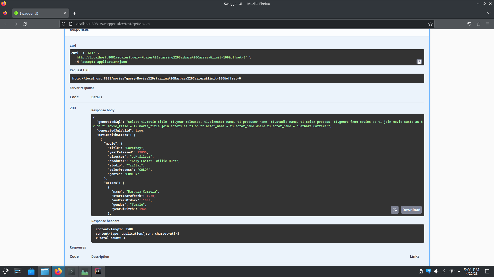

# Text2SQL4j

## Description

This is a tech demo to experiment with making a text to sql translator using strategies taken from the
[Picard](https://github.com/ServiceNow/picard) project. We utilized a [T5 model](https://huggingface.co/tscholak/3vnuv1vf) 
trained by the Picard project and paired that with our own constrained decoder that was inspired by Picard's.
The constrained decoder both uses a forced vocabulary to force a prefix in the generation and a logits processor
that validates that the generated SQL is valid according to a parser that utilizes the [PyParsing](https://pypi.org/project/pyparsing/) 
library. The parser we used was adapted from [this example](https://github.com/pyparsing/pyparsing/blob/master/examples/select_parser.py).

The actual translator is written in Python using [Huggingface](https://huggingface.co/) and [PyTorch](https://pytorch.org/).
Picard's model was set up to work with these libraries, so that was the easiest route available. [Deep Java Library](https://docs.djl.ai/docs/serving/index.html)
was used to make that translation model available to the demo. It made serving up the model quite easy and claims
to have support for starting multiple Python processes depending on the load. The main problem is that each
Python process takes up 5gb of RAM and is effectively single-threaded (i.e. only one translation job at a time per loaded model/process).
That's due to Python's Global Interpreter Lock and Huggingface can only get around that by changing their design.
There's a lot of room for improvement with text generation libraries.

Evaluation for the project was done in the `translator` module's at `com.text2sql4j.translator.DjlSqlTranslatorTest#spider_dataset`.
That test uses the [Spider Dataset](https://yale-lily.github.io/spider) to test our translator and we have our own take on the content
overlap algorithm that was used for evaluating the results of the translator against what is expected.

The `api` module contains a REST server with a Swagger UI frontend and movie database that was used to explore real use
cases for the translator. Our translator supports a forced prefix and we used that to ensure the generated SQL targets
our movie table and returns the expected columns. We also injected a `DISTINCT ON` clause to the generated SQL and
added as a subquery within the final query that has the `ORDER BY`, `LIMIT` and `OFFSET` clauses. All in all it works, 
but the generated queries could be more efficient.

## Failed Experiments

### Tree Sitter Parser

We attempted to use [tree-sitter](https://tree-sitter.github.io/tree-sitter/) as the parser for validating the generated
SQL, but it was difficult to get working for the incremental parsing case. We instead used [PyParsing](https://pypi.org/project/pyparsing/)
and the grammar found for that parser worked better with incomplete SQL, but still wasn't as good as it could have been.

### TorchScript and Deep Java Library

Transforming a Torch model into a ONNYX Runtime or TorchScript model so that it can be used by different libraries
and languages seemed interesting. We wanted to explore this to see if it worked and while the experiment was a failure
due to [Deep Java Library](https://docs.djl.ai/docs/serving/index.html) not having text generation support, there's
still a lot of potential benefits of doing this. We've seen claims of the ONNYX Runtime having better performance than
Torch due to how lighter weight it is. Using a model in a language that fully supports multithreading (i.e. not Python) 
also can be more memory efficient because these models can be thread-safe and used by multiple threads at the same time.
You might say that you only want a single thread to use a model at a time anyway due to the load on the GPU(s)/CPU(s),
but in the case of Huggingface's `model.generate()`, the GPU(s)/CPU(s) won't be used 100% of the time while it is
holding the model hostage (e.g. logit processors execute between the subsequent decoder passes).

## Proposal

The proposal for the project can be found in `./proposal/`. The proposal and what actually was developed is quite different.
There was interest in developing an NLP solution for Java and while that was achieved we weren't able to get text
generation working without relying on Python, so we had to mostly abandon Deep Java Library and OpenNLP. Deep Java Library 
almost had what we needed, but doesn't have text generation support yet.
It's disappointing how immature text generation is at the moment, but solutions still exist.

## Setup

- Installt Python 3.7 and set `PYTHON_EXECUTABLE` environment variable. Deep Java Library uses that variable to install requirements
  and spawn Python processes that host the Huggingface translator. If running tests in an IDE, then the python executable
  needs to have less strict permissions (e.g. `sudo chmod 777 $PYTHON_EXECUTABLE`).

```shell
export PYTHON_EXECUTABLE=/home/jake/miniconda3/bin/python
```

- Run the following command to clone the djl-serving project and install its Python library, which will be used for
  running our Huggingface translator.

```shell
sh setup_djl_serving.sh
```

- Run the following command to download the Picard model to `./raw-files/t5.1.1.lm100k.large/`:

```shell
sh download_model.sh
```

- Download JDK 11:

```shell
sudo apt install openjdk-11-jdk
```

- Gradle is used for building and running tests, but the `./gradlew` file should ensure that it doesn't need to be downloaded.

- Install docker-compose:

```shell
sudo apt install docker-compose
```

## Library Dependencies

### Python

- Huggingface Transformers: Used to load the Huggingface model and tokenizer downloaded from `huggingface.co`.
- Torch: Used to trace the loaded model and export it to the `TorchScript` format.

### Java

- Deep Java Library: The framework to be used for our NLP tasks.
- DJL Torch Engine: `Torch` will be the engine we're using for loading our `TorchScript` Huggingface model. `Deep Java Library` has built-in support for it.
- DJL Huggingface Tokenizers Extension: `Deep Java Library` offers a Huggingface tokenizer extension that is basically a wrapper for a Rust library written by Huggingface.
  This library allows for a Huggingface tokenizer object to be loaded from our `tokenizer.json` file, which is very similar to what we'd normally do in Python.
  To be clear, we don't need any other Huggingface libraries for interacting with our model because it is in a format that `Torch` and `Deep Java Library` can work with.

## Model

The model that we're going to use is a T5 model that has been fine-tuned in the [Picard](https://github.com/ServiceNow/picard) project.
They have two variants: https://huggingface.co/tscholak/3vnuv1vf and https://huggingface.co/tscholak/cxmefzzi. The first
is a smaller model that branched off of the `t5.1.1.lm100k.large` model with ~800 million parameters. The second is the larger
model that branched off of the `t5.3b` model with ~3 billion parameters.

### TorchScript Conversion

(Abandoned due to text generation unsupported in Deep Java Library)

A TorchScript conversion was experimented with to allow the model to be used by different languages. There can be multiple
use cases for why a different language might be used: better multithreading support (i.e. bypassing Python GIL) and
using execution environments better suited for another language (e.g. Android application).

For the TorchScript conversion we're specifically interested in these files from the HuggingFace model: `pytorch_model.bin`,
`config.json` and `tokenizer.json`. The first two need to be converted to the `TorchScript` format and the `tokenizer.json`
has the vocabulary and will be used to create a tokenizer.

The `./model-conversion/` directory holds a Jupiyter notebook that was used for converting our downloaded model into
the TorchScript format. It may be out of date since it was abandoned, but was working at one point. After more research
it seems that the TorchScript conversion wasn't entirely correct because it didn't make use of Huggingface's `model.generate()`
function during the tracing. Deep Java Library doesn't yet have text generation support at the moment, so that will not
be explored further. This experiment would have worked if we only needed classification or a non-autoregressive model.

## Running

### Python Tests

Run the following commands to run the unit tests in `./python-translator/tests/`:

```shell
cd python-translator
python -m unittest discover -s tests -p '*_test.py'
```

### Java Tests

Run the following commands to execute the Java unit tests:

```shell
cd docker
sudo docker-compose up -d
cd ..
sh gradlew test
```

The output from the tests that I ran can be found in the `./test-output/` directory. Just open the `index.html` files
for each module and the standard out for the tests is available. There the prediction accuracy for the Spider evaluation
can be seen, which is about `61%`. My own take on the content overlap evaluation strategy was used to calculate that
accuracy. The total number of expected output tokens for all translations (while ignoring the few timeout failures)
is compared against the matched tokens found in the content overlap to determine the overall accuracy.

IMPORTANT NOTE:

It should be noted that expected queries with more tokens will impact the overall prediction accuracy more than queries
with less tokens! That's just how my personal content overlap evaluation works and was fully intended to work in that
manner. Different evaluation strategies exist and my strategy might not fully match what others have done. Call it
Jake's content overlap evaluation algorithm if you care that it differs from how others have done it.

### Start Swagger UI

To experiment with the translator the backend can be stood up and tested using Swagger UI. If the database is empty,
then a UCI movie dataset is inserted into the database.

```shell
cd docker
# The database needs to be empty in order for the movie dataset to be inserted on startup of the backend!
sudo rm -rf data
sudo docker-compose up -d
cd ..
sh gradlew run
```

After starting the backend the Swagger UI is available at, `http://localhost:8081/swagger-ui`.









## References

### PICARD

This was the starting point for the demo. We're utilizing on of their T5 models and we took inspiration from the way
that they made their constrained decoder that validates the generated sql.

@misc{scholak2021picard,
title={PICARD: Parsing Incrementally for Constrained Auto-Regressive Decoding from Language Models},
author={Torsten Scholak and Nathan Schucher and Dzmitry Bahdanau},
year={2021},
eprint={2109.05093},
archivePrefix={arXiv},
primaryClass={cs.CL}
}

### Huggingface Transformers

The Huggingface transformers project is what we used to actually run the autoregressive text generation with a
constrained decoder that validates the generated sql.

@inproceedings{wolf-etal-2020-transformers,
title = "Transformers: State-of-the-Art Natural Language Processing",
author = "Thomas Wolf and Lysandre Debut and Victor Sanh and Julien Chaumond and Clement Delangue and Anthony Moi and Pierric Cistac and Tim Rault and Rémi Louf and Morgan Funtowicz and Joe Davison and Sam Shleifer and Patrick von Platen and Clara Ma and Yacine Jernite and Julien Plu and Canwen Xu and Teven Le Scao and Sylvain Gugger and Mariama Drame and Quentin Lhoest and Alexander M. Rush",
booktitle = "Proceedings of the 2020 Conference on Empirical Methods in Natural Language Processing: System Demonstrations",
month = oct,
year = "2020",
address = "Online",
publisher = "Association for Computational Linguistics",
url = "https://www.aclweb.org/anthology/2020.emnlp-demos.6",
pages = "38--45"
}

### Spider SQL Dataset

This was used for evaluating the text to sql translation.

@misc{yu2019spider,
title={Spider: A Large-Scale Human-Labeled Dataset for Complex and Cross-Domain Semantic Parsing and Text-to-SQL Task},
author={Tao Yu and Rui Zhang and Kai Yang and Michihiro Yasunaga and Dongxu Wang and Zifan Li and James Ma and Irene Li and Qingning Yao and Shanelle Roman and Zilin Zhang and Dragomir Radev},
year={2019},
eprint={1809.08887},
archivePrefix={arXiv},
primaryClass={cs.CL}
}

### UCI Movie Dataset

This was used to fill up the application database that is used for this demo.

@misc{misc_movie_132,
author       = {Wiederhold,Gio},
title        = {{Movie}},
year         = {1999},
howpublished = {UCI Machine Learning Repository},
note         = {{DOI}: \url{10.24432/C5SW2R}}
}